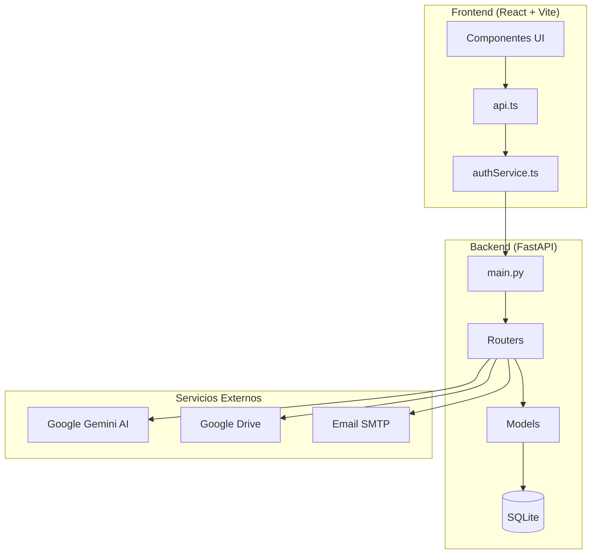
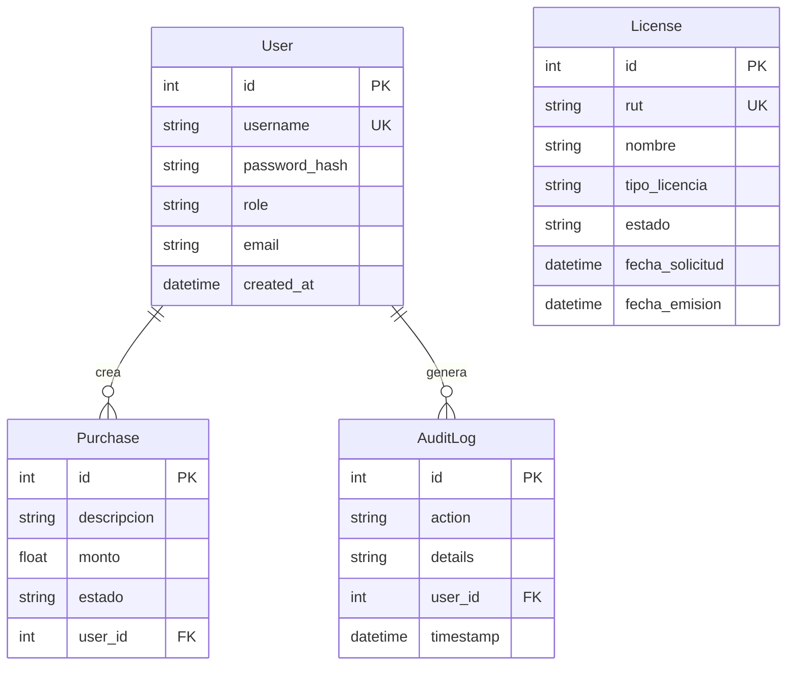
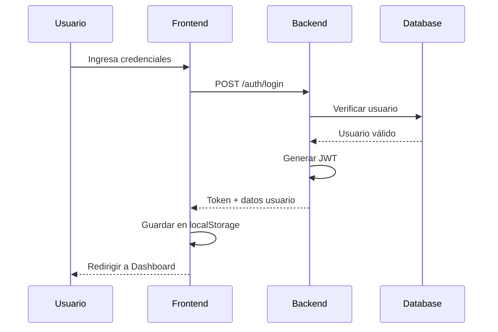
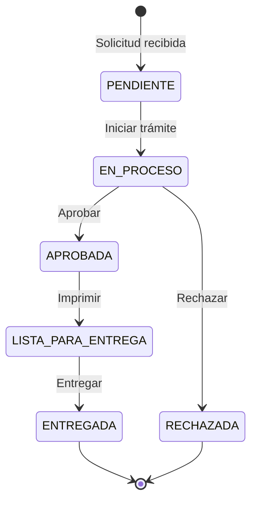
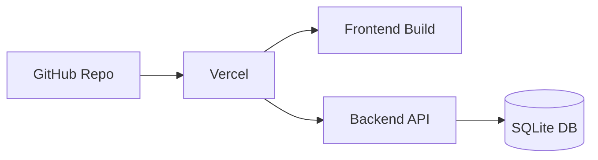

# 🏗️ Arquitectura del Sistema

## Visión General

## Módulos del Backend

### Routers (Endpoints)

| Router | Ruta Base | Descripción |
|--------|-----------|-------------|
| `auth.py` | `/auth` | Login, registro, tokens JWT |
| `licenses.py` | `/licenses` | CRUD completo de licencias |
| `ai.py` | `/ai` | Análisis con Gemini |
| `drive.py` | `/drive` | Sincronización Google Drive |
| `logs.py` | `/logs` | Auditoría de acciones |
| `purchases.py` | `/purchases` | Gestión de compras |
| `appointments.py` | `/appointments` | Citas y turnos |
| `public.py` | `/public` | Portal público |

### Modelos de Datos

## Flujo de Autenticación

## Componentes Frontend

### Principales

| Componente | Descripción |
|------------|-------------|
| `App.tsx` | Enrutamiento y layout principal |
| `LoginScreen.tsx` | Autenticación de usuarios |
| `LicenseTable.tsx` | Tabla principal con filtros |
| `UploadArea.tsx` | Carga de Excel/XML |
| `AnalyticsDashboard.tsx` | Gráficos y estadísticas |

### Módulos Especiales

| Componente | Función |
|------------|---------|
| `Module12.tsx` | Entrega de licencias |
| `Module16.tsx` | Resolución de problemas |
| `DriveSyncArea.tsx` | Sincronización con Drive |
| `PurchasesManagement.tsx` | Gestión de compras |

## Estados de Licencia

## Seguridad

- **JWT**: Tokens con expiración de 24 horas
- **Bcrypt**: Hash de contraseñas
- **CORS**: Configurado para dominios permitidos
- **Roles**: Control de acceso por rol (admin/operator/viewer)

## Despliegue

---

> Última actualización: Enero 2026
